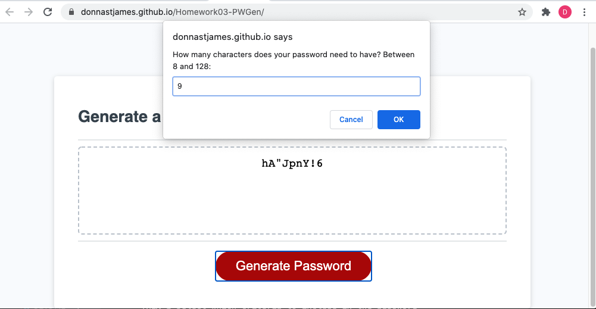

# Homework03-PWGen

## Description

This is a password generator using Javascript.  I used arrays to fulfill acceptance criteria.  I used window.prompt() to request the number of characters required, but used window.confirm() to ask whether to use lower case, upper case, numbers and/or special characters, to prevent the user from entering invalid data.  I also added code to prevent the user from typing an invalid password length.  I added comments to briefly explain how I implemented this password generator.  

